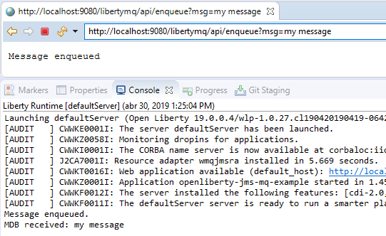
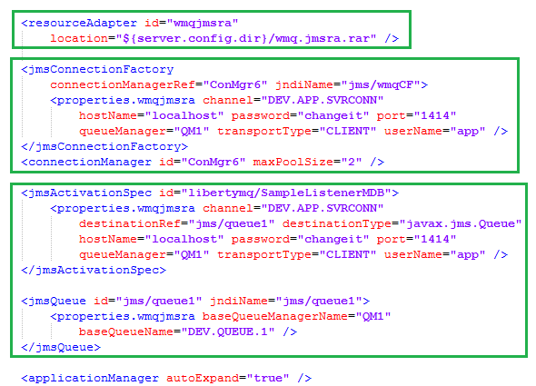

# Open Liberty - JMS & IBM MQ

A sample application that uses Open Liberty to connect to IBM MQ to enqueue & dequeue messages with JMS.

# Setup

Here are the versions used to build this application at the time, but feel free to use the one that reflects your environment.

* Open Liberty 19.0.0.4
* Open Liberty Tools 19.0.0.3
* OpenJDK 11.0.2+9
* IBM MQ 9.1.0.0 (Trial)
* Windows 10
* Eclipse 2019-03 (4.11.0)

Use the following steps to run this example:

## 1) Install IBM MQ

Download, install and configure IBM MQ. You'll find all the steps provided by IBM in this tutorial:

https://developer.ibm.com/messaging/learn-mq/mq-tutorials/mq-connect-to-queue-manager/

In there you'll receive a script that will create all the resources in MQ that are referenced by the application. I did it with Windows but you can pick the platform of your choice.

## 2) Download JDK

If you don't have it yet, download the JDK.

I did use OpenJDK 11, the latest supported by Open Liberty at the time of the development. 

## 3) Choose an IDE

I did use Eclipse for this example, but fell free to use the IDE of your choice.

Download Eclipse and install IBM Liberty Developer tools: https://marketplace.eclipse.org/content/ibm-liberty-developer-tools

## 4) Download Open Liberty

1. Download Open Liberty: https://openliberty.io/downloads
2. Unzip it
3. Add Open Liberty to your Eclipse and create a New Server (you can choose the default server template for now)

## 5) Download MQ Resource Adapter

Download the resource adapter `wmq.jmsra.rar` provided by IBM that allows JMS to work with IBM MQ.

https://www-01.ibm.com/support/docview.wss?uid=swg21668491

Copy it to Liberty config directory, that is the user server root, like this:

`wlp/usr/servers/defaultServer/wmq.jmsra.rar`

## 6) Configure Liberty Server

From [/liberty](/liberty) directory in this repository structure, copy `server.xml` and `jvm.options` to Liberty configuration directory:

`wlp/usr/servers/defaultServer/`

The key part of this example is the `server.xml`, with resource declaration, enqueue connection factory and the activation of the MDB for dequeue with JMS.

## 7) Run and test the application

Finally, deploy the application to Liberty and enqueue a message by the following URL:

http://localhost:9080/libertymq/api/enqueue?msg=somemessage

You should be able to see the enqueue confirmation in the browser, and the dequeue in the console.

# References

Links to resources that helped me solve the configuration:

- https://www.ibm.com/support/knowledgecenter/SSEQTP_liberty/com.ibm.websphere.wlp.doc/ae/twlp_dep_msg_mdbwmq.html
- https://www.ibm.com/support/knowledgecenter/en/SSFKSJ_9.1.0/com.ibm.mq.dev.doc/q120040_.htm
- https://www.ibm.com/support/knowledgecenter/en/SSGMCP_5.3.0/com.ibm.cics.ts.java.doc/topics/dfhpj_webspheremq_jmsliberty_configure.html
- https://rieckpil.de/howto-simple-jms-application-with-the-embedded-messaging-engine-in-open-liberty/
- http://blog.patrikvarga.com/2012/11/ibm-mq-object-authorization-for-jms.html
- https://developer.ibm.com/messaging/learn-mq/mq-tutorials/develop-mq-jms/
- https://developer.ibm.com/messaging/learn-mq/mq-tutorials/
- https://developer.ibm.com/messaging/learn-mq/mq-tutorials/mq-connect-to-queue-manager/#win
